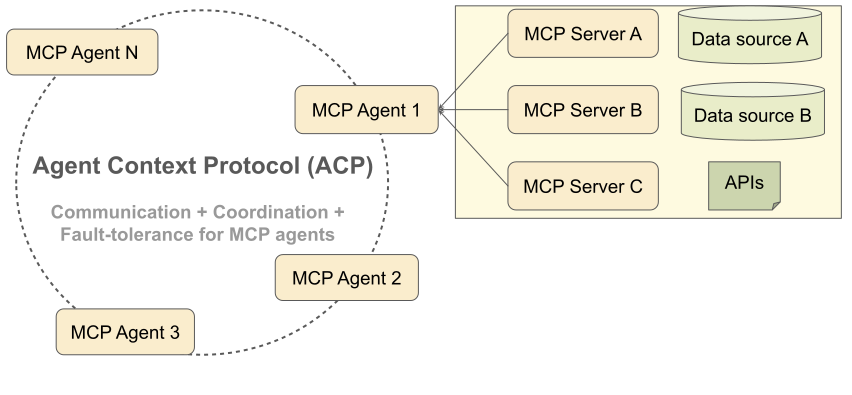

# Vibe Analyst: The future of data science 

**A paradigm where we "vibe" with data to uncover insights — where intuition is translated into intelligence with a few prompts and clicks.**

In an increasingly data-centric world, data science should be as simple as "vibing" with your data, where agentic systems can translate your intution into concrete  actionable insights and recommendations. 

Vibe analyst does exactly this. Vibe analyst leverages a sophisticated multi-agent reasoning system built on top of state-of-the-art agents. Users simply vibe with their data and ACP does the heavy lifting on complex reasoning on multi-dimensional data streams.

Users plug into their data through Model Context Protocol (MCP) servers, and simply start "vibing" with their data to find insights, answers and recommendations.

Vibe-analyst leverages **Agent Context Protocols (ACP)** to build a sophisticated multi-agent reasoning system on top of state-of-the-art agents.

## Agent Context Protocols (ACP)


Vibe Analyst is powered by our invention, *Agent Context Protocols (ACP)*. 
Agent Context Protocols are the first standardized protocols for building multi-agent reasoning systems.

ACP are a domain and agent-agnostic set of structured protocols for agent-agent communication, coordination, and error handling.
ACPs enable fault-tolerant and long-horizon multi-step collective inference across a diverse set of domain and task-specialized agents.

**Why this matters:** Combine specialized state-of-the-art agents with ACP to build state-of-the-art general multi-agent systems. 

**ACP + MCP:** Rapidly prototype multi-agent systems. Combine any set of state-of-the-art agents with ACP and access any set of contexts with MCP (Model Context Protocols) to create state-of-the-art muti-agent applications.

## Setup Guide

### Installation

```bash
pip install agent_context_protocol  

git clone https://github.com/acp/vibe-analyst.git
cd vibe-analyst
```

### Setting up MCP Servers

Vibe Analyst integrates seamlessly with Multiple Context Protocol (MCP) servers, enabling ACP to manage complex tasks effectively. By default, the following MCP servers are included:

1. **`github`**: Manage GitHub repositories, issues, pull requests, and commits.
2. **`perplexity-ask`**: Perform AI-driven searches and obtain detailed research summaries.
3. **`google-maps`**: Geocode locations, route planning, and place searches.
4. **`slack`**: Integrate Slack messaging directly into workflows.
5. **`mcp-server-chart`**: Create dynamic visualizations and charts.
6. **`youtube-video-summarizer-mcp`**: Automatically summarize YouTube videos.
7. **`everart`**: Generate visuals and creative artwork using generative AI.
8. **`postgres`**: Execute queries and interact seamlessly with PostgreSQL databases.
9. **`google-calendar-mcp`**: Programmatically manage events on Google Calendar.

To add a new server:

* **Python-based servers**: Specify the path to the server's `server.py` file and its virtual environment, along with required environment variables or arguments (refer to the included `config.yml`).
* **Node-based servers**: Provide the path to the built `index.js` after running `npm install`, along with required environment variables or arguments (see examples in `config.yml`).

An example `config.yml` file is provided. To integrate a new MCP server, simply install it and update the `config.yml` accordingly.

### Required Environment Variables
Create a `.env` file with the following command:
`export OPENAI_API_KEY=your_api_key`

For utilising the existing **MCP Servers**
Set up these variables according to each server’s documentation:

* `GITHUB_PERSONAL_ACCESS_TOKEN`
* `PERPLEXITY_API_KEY`
* `GOOGLE_MAPS_API_KEY`
* `SLACK_BOT_TOKEN`
* `SLACK_TEAM_ID`
* `EVERART_API_KEY`
* `database_url` (for PostgreSQL)

Put these variables in the config.yml.

**Optional:**

* `SLACK_CHANNEL_IDS`

Finally, run:

```bash
streamlit run app.py
```

Then open your browser at [http://localhost:8501](http://localhost:8501) to start using Vibe Analyst.

---

## `app.py`—Interactive Dashboard Overview

Vibe Analyst (`app.py`) provides an elegant Streamlit-based dashboard featuring:

* **Natural Task Input:** Easily input prompts in plain language or structured JSON.
* **Real-Time DAG Visualization:** Interactive, live-updating Directed Acyclic Graphs (DAGs) clearly show subtasks, dependencies, and execution flow.
* **User-Friendly Outputs:** Dark-themed, responsive UI, ensuring clarity and aesthetic appeal.

You can also customize the dashboard's appearance and functionality by modifying the dashboard prompt. The dashboard prompt defines how tasks, statuses, and agent outputs are presented, allowing you to tailor the visual and interactive aspects of the Vibe Analyst to suit your preferences or requirements.

---

### Roadmap

Vibe analyst, powered by ACPs, reflects a major a shift in agentic applications.

ACP + MCP is a powerful design pattern. ACP enables agents to reason together, while MCP gives them contextual access to live, multidimensional data.

Together, they unlock a new software paradigm — where practioners rapidly prototype agentic applications by simply plugging in context from MCP into ACP. 

Looking ahead, we aim to expand these capabilities and usability through the following key directions:

1. **Generalized Integration**  
   Extend ACP's integration framework to support a broader range of tools beyond MCP servers. This will include a more modular and standardized approach to adding tools, enabling seamless orchestration with minimal configuration.

2. **Dynamic Agent Ecosystem**  
   Introduce mechanisms for agents to dynamically discover, register, and collaborate with new tools or other agents during runtime, fostering a more adaptive and scalable system.

3. **Enhanced User Experience**  
   Improve the dashboard's interactivity and customization options, including advanced visualization features, such as task timelines, performance metrics, and real-time execution insights.

4. **Interactivity**  
   Enable users to define and automate complex workflows by introducing a drag-and-drop interface for task pipelines and execution strategies.

5. **Comprehensive Documentation and Community Support**  
   Expand documentation with detailed guides, examples, and tutorials. Foster a community-driven ecosystem to encourage contributions, feedback, and shared use cases.

---
